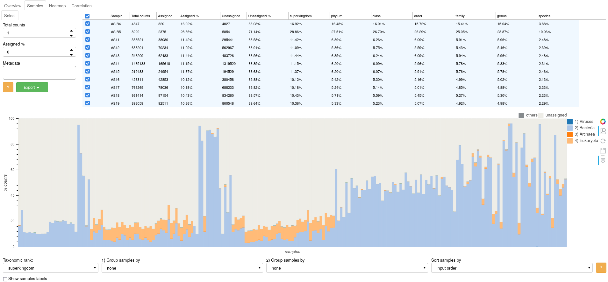
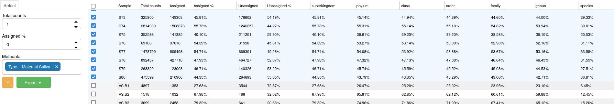
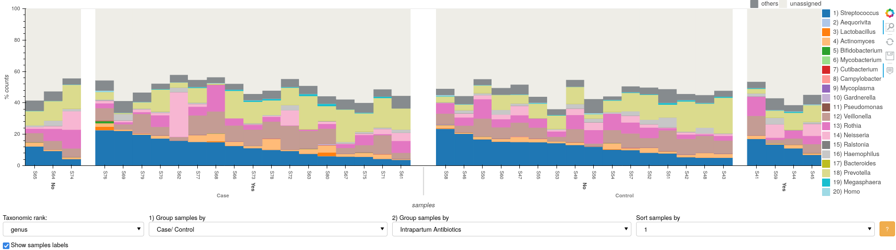
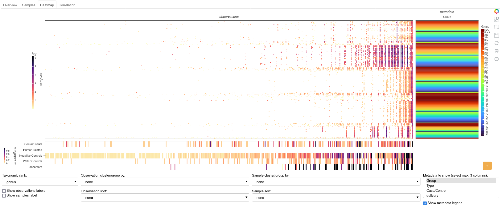
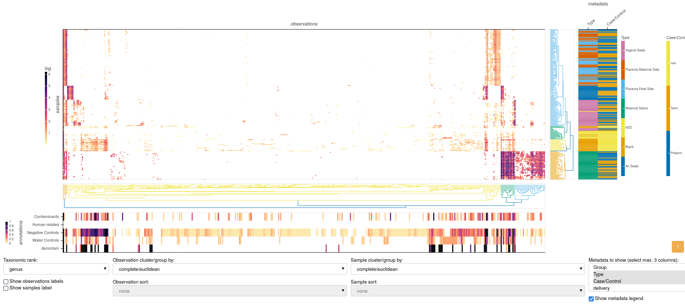
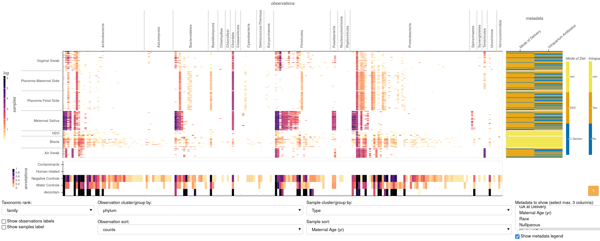
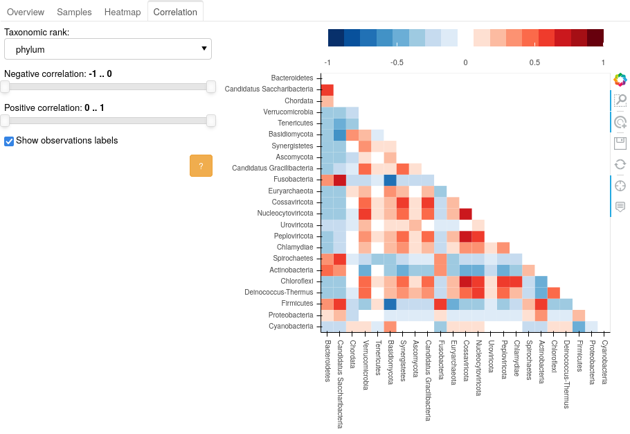
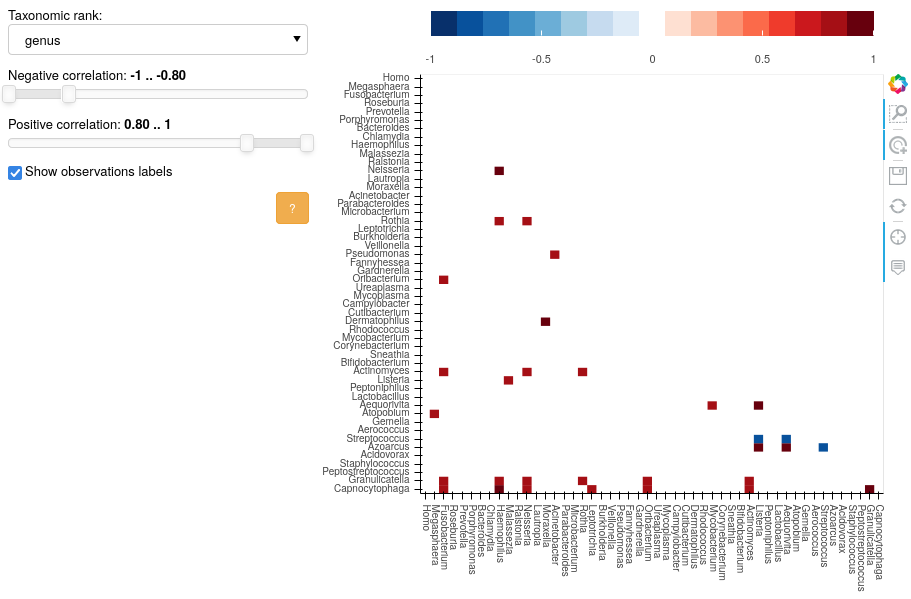

# GRIMER Reports - User Manual

---

*For this manual, the metagenomics analysis is based on data from Leiby et al. "Lack of detection of a human placenta microbiome in samples from preterm and term deliveries"*

- **[GRIMER report MGS Leiby et al.](https://pirovc.github.io/grimer-reports/placenta/placenta_mgs.html){ target="_blank" }**

--- 

GRIMER report contains 4 main panels: [Overview](#overview), [Samples](#samples), [Heatmap](#heatmap), and [Correlation](#correlation). Every panel has one or more visualization and widgets to select, filter, group, and modify its contents. 

- Panels can be reported independently with `-p/--output-plots`
- Help buttons  provide details and information about the plot/analysis
- All plots have built-in tools to export a png, show/hide tooltips, zoom in/out, select entries, among other features 

## Overview

The Overview panel shows an individual summary for each observation, related annotations and their distribution among samples.

 

### Table

On the top, a table will list the observations of the study (e.g. OTUS, species). If taxons are the observations, entries can be divided into taxonomic ranks.

 

- It is possible to filter the items listed on the table using the widgets on the rigth
- Each entry will contain some details about the observations (e.g. Frequency among samples, total counts, ...)
- Selecting an item on the table will activate further details of the observation in the other plots of the panel

For example, the genus *Streptococcus*:

 

- Appears on 61% of the samples of this study.
- Has an average of 2.5% relative abundance among all samples.
- Was reported in 5 studies as a "common contaminant".
- It is highly present in water and negative control samples.
- It was detected as a possible contaminant by the DECONTAM method.

### Side plots

On the top right, additional plots and information are display once an observation is selected on the Table. In this example, the *Streptococcus* genus is selected.

#### Info

 

- Further information about the observation and related references is displayed. In this case, common contaminants sources.

#### References

 

- This plot shows the number of counts of the observation in the provided references (and the counts on the taxonomic lineage).
- In the example above, the genus *Streptococcus* was reported 5 times directly in one of the reference sets (common contaminants), and 3 times as parent (some species of *Streptococcus* were reported as contaminants).

#### MGnify

 

- This plot shows the number of studies in the MGnify database for the selected observation.
- *Streptococcus* was reported in 316 studies for the biome "Host Associated:Human".
- In-detail biome levels can be selected to define more specific groups. In the biome level 5 (see below), *Streptococcus* was reported to be mostly found in Fecal samples among all MGnify studies.

 

#### DECONTAM

 

- This plot can be used to verify the DECONTAM output.
- It shows the proportion of counts of the selected observation (y-axis) against DNA Concentration (if provided) or Total number of counts (x-axis) of each sample, both in log10 scale.
- Controls samples are displayed in a different color.
- An indication of contamination can be defined when counts are inversely proportional to DNA concentration. The red and black dotted lines are the expected models for contamination and non-contamination, respectively, based on the data of the study. A good indication for contamination is when the counts (excluding the control samples) "fit" the red line model.
- The P-score statistic is not a P-value and it is not associated with any guarantees on the type 1 error rate. Small scores indicate the contaminant model is a better fit, and high scores indicate that the non-contaminant model is a better fit.
- More details about the DECONTAM method and output can be found [here](https://benjjneb.github.io/decontam/vignettes/decontam_intro.html){ target="_blank" }.

### Sample bars

This plot summarizes samples content, annotated with general classification metrics (left y-axis). Annotations can be selected on the bottom dropdown lists. Once an observation is selected on the top table, this plot will also show the count of the observation for each sample (right y-axis). 

 

- Bars are showing total number of counts for each sample and are annotated with the percentage of "human-related" taxa, provided as a reference.
- The x-axis is grouped by two metadata variables: Type and Case/control. Each sub-group is sorted based on the number of counts (in this case reads).
- Yellow circles (right y-axis) are showing the amount of the selected observation (*Streptococcus*) for each one of the samples in a log scale.
- Parent taxonomic ranks can be activated on the top-rigth legend.

## Samples

In-depth evaluation of individual samples can be performed in this panel.

### Table

- The top table lists all samples in the study, with information about assigned and unassigned counts.
- Further information for the abundance of each taxonomic rank is display if enabled for the report.
- Rows of the table can be selected using the widgets on the right (or manually with the checkboxes). Selected items will be displayed in the bar plot. In the example above, only samples belonging to the "Maternal Saliva" category for the metadata field "Type" are selected.
 
### Bars

- Observation bars showing proportions of top most abundant taxa. The number of items to be displayed can defined with the parameter `-j/--top-obs-bars`
- In the example above, genus level proportions are displayed only for the items selected in the table.
- The bars are grouped by Case/Control and antibiotic usage. Samples are sorted by the *Streptococcus* (1) abundances within each group.

## Heatmap

Several transformations (`-a/--transformation`) can be applied to the data (normalization, log, center log ratio) to be further visualized in the Heatmap panel. Hierarchical clustering, grouping and sorting options can be independently selected for samples and observations to enable pattern detection (e.g. batch effects, treatment effects etc).

- The heatmap shows values for samples (y-axis) and observations (x-axis).
- Side panels link metadata and annotation information to the heatmap axis.
- By default, all external references are displayed. Metadata field(s) can manually selected in bottom-right list.

### Clustering

- Heatmap data can be sorted by hierarchical/agglomerative clustering.
- More clustering methods and metrics can be generated using the parameter `--linkage-methods` and `--linkage-metrics`.
- Additional dendrograms are displayed on the clustered axis.
- Here is possible to explore effects of clusters of data in the external panels (annotations and metadata).

### Grouping

- Grouping of the heatmap data can be done by taxonomic ranks for observation and metadata for samples.
- Data can be further sorted among groups.

## Correlation

Correlation between all observations in the study are plotted as a heatmap matrix. Positive or negative correlations among observations point to concurrent signals in the microbiome analysis (e.g. certain species with similar abudances in the study).

- In the example above, only top observations are displayed. This can be changed with the parameter `-x/--top-obs-corr`.
- Only highly positive or negative correlated organisms are displayed: -1 to -0.8 and 0.8 to 1, respectively
- Organisms highly correlated can be further investigated in the Overview and Heatmap panels.