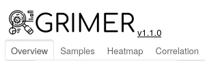
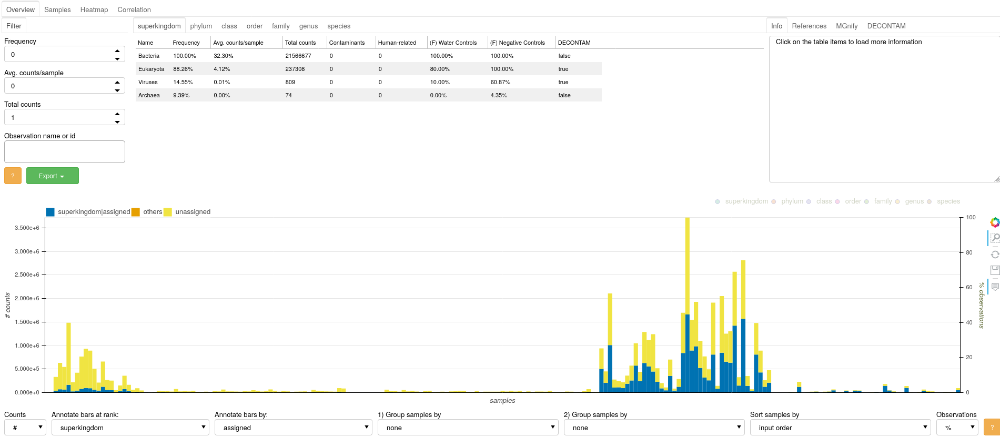
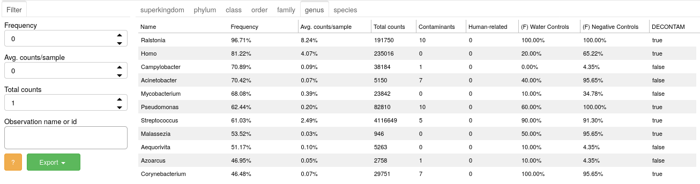
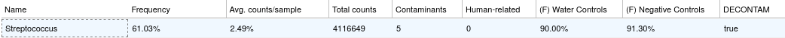
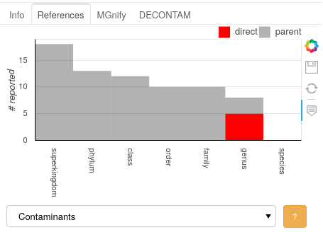
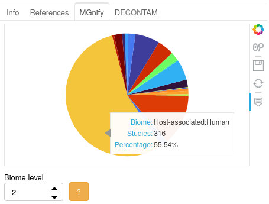
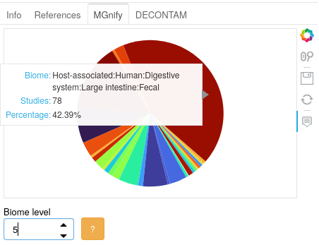

# GRIMER Reports - User Manual

---

*For this manual we will use the metagenomics analysis from data obtained from Leiby et al. "Lack of detection of a human placenta microbiome in samples from preterm and term deliveries"*

- **[GRIMER report MGS Leiby et al.](https://pirovc.github.io/grimer-reports/placenta/placenta_mgs.html)**

--- 

GRIMER reports contain 4 main panels: [Overview](#overview), [Samples](#samples), [Heatmap](#heatmap), and [Correlation](#correlation). Every panel has one or more visualization and widgets to select, filter, group, and modify its contents. 

- Help buttons  will provide details and information about the plot/analysis
- Panels can be reported independently with `-p/--output-plots`

## Overview

The Overview panel shows an individual summary for each observation and its relation to annotations and distribution among samples.

 

### Table

In the top, a table will list the observations of the study (e.g. OTUS, species). If taxons are the observations, entries can be divided into taxonomic ranks.

 

- It is possible to filter the items listed on table using the widgets on the rigth
- Each entry will contain some details about each observation (e.g. Frequency among samples, total counts, ...)
- Selecting an item on the table will trigger the activation of the observation in the other plots of the panel

For example, the genus Streptococcus:

 

- Appears on 61% of the samples of this study
- Has an average 2.5% relative abundance among all samples
- Was reported in 5 studies as "common contaminant"
- It is highly present in water and negative control samples
- It was detected as a possible contaminant by the DECONTAM method

### Side plots

On the top right, additional plots and information are display once an observation is selected on the Table. In this example, the Streptococcus genus is selected.

#### Info

 

- Further information about the observation and related references can be found (in this case, common contaminants)

#### References

 

- Visual representation of number of counts in the references and it's lineage
- In the example above, the genus Streptococcus was reported 5 times in one of the reference sets (common contaminants) directly, and 3 times as parent (species of Streptococcus were reported as contaminant)

#### MGnify

 

- This plot shows the number of studies in the MGnify database for the selected taxa
- Streptococcus was reported in 316 studies for the biome Host Associated:Human
- Deeper biome levels can be selected to define more specific groups. In the biome level 5 (see below), Streptococcus was reported to be mostly found in Fecal samples among all MGnify studies.

 

#### DECONTAM

 

- Plot to verify the DECONTAM output
- Proportion of counts of selected observation (y-axis) against DNA Concentration (if provided) or Total number of counts (x-axis) of each sample, both in log10 scale
- If provided, controls samples are displayed in a different color.
- A indication of contamination is when counts are inversely proportional to DNA concentration. The red and black dotted lines are the expected models for contamination and non-contamination, respectively. A good indication for contamination is when the dots (excluding control samples) "fit" the red line model.
- The P-score statistic is not a P-value and it is not associated with any guarantees on the type 1 error rate. Small scores indicate the contaminant model is a better fit, and high scores indicate that the non-contaminant model is a better fit.

### Sample bars

This plot ummarizes samples contents, with general classification metrics (left y-axis). Once an item is selected on the top table, this plot will also show the amount of the observation for each sample (right y-axis). 

 

- aa

## Samples

In depth evaluation of individual samples can be performed in the Samples panel

## Heatmap

Several transformations can be applied to the data (normalization, log, center log ratio) to be further visualized in the Heatmap panel. Hierarchical clustering, grouping and sorting options can be independently selected for samples and observations to enable pattern detection (e.g. batch effects, treatment effects etc).

## Correlation

Correlation between observations are plotted as a heatmap matrix. Positive or negative correlations among observations can point towards concurrent signals in the microbiome analysis.